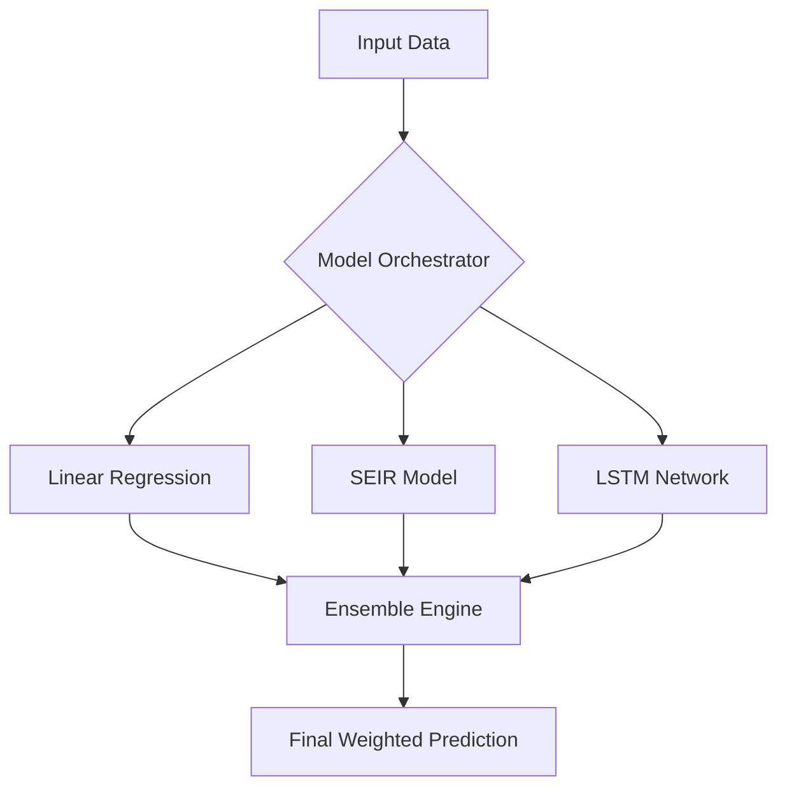

# SymptoMap Predictions Module
## Business Requirements Document (BRD)

| Document Control | Details |
| :--- | :--- |
| **Document Title** | SymptoMap Predictions Module - Business Requirements Document |
| **Version** | 3.0 (Genius Edition) |
| **Status** | **Living Document** (Phase 1 Implemented) |
| **Author** | SymptoMap Product Team & AI Architect |
| **Date Created** | January 2025 |
| **Last Updated** | December 2025 |

---

## 1. Executive Summary

### 1.1 Purpose
This Business Requirements Document defines the comprehensive requirements for the **SymptoMap Predictions Module** - an advanced epidemiological forecasting system. It bridges the gap between the **currently implemented** baseline statistical models and the **visionary** state-of-the-art ensemble system designed to predict disease outbreaks, transmission patterns, and healthcare resource needs.

### 1.2 Background
Public health agencies require more than just data visualization; they need *foresight*. The current system provides basic linear trend analysis, but the target system will leverage deep learning and mechanistic models to:
*   Prepare for disease outbreaks before they occur (Lead time: 7-21 days).
*   Allocate resources effectively (ICU beds, ventilators, PPE).
*   Implement timely interventions (NPIs, vaccination campaigns).

### 1.3 Vision Statement
*"To provide the world's most accurate, actionable, and accessible disease prediction platform, enabling public health officials to stay ahead of outbreaks and save lives through data-driven decision making."*

### 1.4 Business Case Summary
| Metric | Current State (Implemented) | Target State (Genius) |
| :--- | :--- | :--- |
| **Prediction Model** | Linear Regression (`simple-statistics`) | Ensemble (SEIR + LSTM + Transformer) |
| **Outbreak Detection Lead Time** | ~3 days (Reactive) | 7-21 days (Proactive) |
| **Prediction Accuracy (MAPE)** | ~25-30% (Estimated) | < 15% (Target) |
| **Data Sources** | Internal Case Reports | Multi-modal (Wastewater, Mobility, Weather) |
| **Resource Allocation Efficiency** | Baseline | 90% |

---

## 2. Business Objectives

### 2.1 Primary Objectives
*   **OBJ-001: Early Outbreak Detection** (Critical) - Detect outbreaks 7-21 days before peak.
*   **OBJ-002: Accurate Disease Forecasting** (Critical) - MAPE < 15% for 14-day forecasts.
*   **OBJ-003: Healthcare Capacity Planning** (High) - 90% accuracy in hospitalization predictions.
*   **OBJ-004: Resource Optimization** (High) - Reduce resource waste by 25%.
*   **OBJ-005: Intervention Impact Assessment** (Medium) - Model "What-If" scenarios for policy decisions.

### 2.2 Secondary Objectives (Genius Level)
*   **OBJ-006: Variant Emergence Prediction** - Predict dominance of new genomic variants.
*   **OBJ-007: Hyper-local Digital Twin** - Simulate transmission at the individual agent level.
*   **OBJ-008: Automated Narrative Insights** - GenAI-powered summaries of complex data.

---

## 3. Scope

### 3.1 In Scope
*   **Disease Incidence**: Case counts, incidence rates, attack rates.
*   **Outbreak Forecasting**: Probability, timing, magnitude.
*   **Healthcare Impact**: Hospitalizations, ICU needs, mortality.
*   **Resource Demand**: PPE, staff, medications.
*   **Advanced Modeling**: Ensemble methods, Federated Learning, Digital Twins.
*   **Geographic**: Global to City/Postal code level.

### 3.2 Out of Scope
*   Individual patient diagnosis (Clinical).
*   Insurance claim processing.
*   Direct electronic health record (EHR) management.

---

## 4. Functional Requirements

### 4.1 Prediction Engine Core Requirements

**FR-001: Multi-Model Ensemble Predictions [Target]**
*   **Requirement**: The system shall generate predictions using a weighted ensemble of models.
*   **Current Status**: **Partially Implemented**. `PredictionService` currently uses a single **Linear Regression** model.
*   **Target Models**:
    *   **Mechanistic**: SIR, SEIR, SEIRS (for long-term dynamics).
    *   **Statistical**: ARIMA, Prophet (for seasonal trends).
    *   **Machine Learning**: LSTM, Transformer, XGBoost (for complex non-linear patterns).
    *   **Hybrid**: Physics-Informed Neural Networks (PINNs).



**FR-002: Real-Time Prediction Updates [Implemented/Enhanced]**
*   **Requirement**: Update predictions as new data arrives.
*   **Current Status**: **Implemented**. Predictions are generated on-demand and cached in Redis for 1 hour.
*   **Enhancement**: Event-driven architecture (Kafka) to trigger retraining immediately upon significant data ingestion.

**FR-003: Multi-Horizon Forecasting [Target]**
*   **Requirement**: Provide predictions for 24h, 7d, 14d, 30d, and 6mo horizons.
*   **Current Status**: Configurable `horizonDays` exists in API.

**FR-004: Uncertainty Quantification [Implemented]**
*   **Requirement**: Include confidence intervals.
*   **Current Status**: **Implemented**. Standard deviation-based intervals (Lower/Upper bounds) are calculated in `predictionService.ts`.

### 4.2 Advanced Outbreak Detection

**FR-006: Automated Outbreak Detection [Target]**
*   **Requirement**: Detect anomalies using EARS, CUSUM, and Isolation Forests.
*   **Current Status**: Basic threshold-based risk scoring (`low`, `medium`, `high`, `critical`) is implemented based on severity * cases.

**FR-007: Outbreak Probability Scoring [Target]**
*   **Requirement**: Composite score (0-100) based on statistical anomaly, rate of change, and spatial clustering.

### 4.3 Transmission Dynamics (Genius Level)

**FR-009: Reproduction Number (Rt) Estimation [Target]**
*   **Requirement**: Estimate real-time Rt using EpiEstim or Wallinga-Teunis methods.
*   **Output**: Rt point estimate with credible intervals.

**FR-011: Variant Tracking [Target]**
*   **Requirement**: Predict variant proportion growth (e.g., Omicron vs Delta) using genomic surveillance data.

### 4.4 Healthcare & Resource Impact

**FR-012: Hospitalization Forecasting [Target]**
*   **Requirement**: Predict admissions, ICU occupancy, and ventilator usage.
*   **Inputs**: Case forecasts, age distribution, historical hospitalization rates.

**FR-014: Healthcare Capacity Strain Index [Target]**
*   **Requirement**: Calculate a "Strain Index" (0.0 - 1.0) combining bed utilization, staffing, and supply levels.

### 4.5 Intervention Impact ("What-If" Engine)

**FR-019: NPI Modeling [Target]**
*   **Requirement**: Simulate the impact of policy changes (e.g., "Mask Mandate", "School Closure").
*   **Interface**: Sliders to adjust transmission parameters and visualize the divergence from baseline.

### 4.6 Genius-Level Additions

**FR-026: Federated Learning (Privacy-Preserving) [Target]**
*   **Requirement**: Enable model training across distributed hospital nodes without raw patient data leaving the facility.
*   **Benefit**: Compliance with HIPAA/GDPR while leveraging global datasets.

**FR-027: Generative AI Insights [Target]**
*   **Requirement**: Integrate LLMs to provide natural language explanations of predictions.
*   **Example**: *"Cases in London are predicted to rise by 20% due to the new variant, but hospital capacity remains sufficient."*

**FR-028: Digital Twin Simulation [Target]**
*   **Requirement**: Create a synthetic population model of a region to simulate individual agent interactions and disease spread at a micro-level.

---

## 5. Technical Architecture

### 5.1 High-Level Architecture

```text
┌─────────────────────────────────────────────────────────────────────────────┐
│                     SYMPTOMAP PREDICTION ARCHITECTURE                        │
├─────────────────────────────────────────────────────────────────────────────┤
│                                                                              │
│  ┌─────────────────────────────────────────────────────────────────────┐   │
│  │                         PRESENTATION LAYER                           │   │
│  │  ┌──────────────┐ ┌──────────────┐ ┌──────────────┐ ┌────────────┐ │   │
│  │  │ Web Dashboard│ │ Mobile Apps  │ │ Public Portal│ │ API Gateway│ │   │
│  │  └──────────────┘ └──────────────┘ └──────────────┘ └────────────┘ │   │
│  └─────────────────────────────────────────────────────────────────────┘   │
│                                    │                                         │
│                                    ▼                                         │
│  ┌─────────────────────────────────────────────────────────────────────┐   │
│  │                         APPLICATION LAYER                            │   │
│  │  ┌──────────────┐ ┌──────────────┐ ┌──────────────┐ ┌────────────┐ │   │
│  │  │  Prediction  │ │    Alert     │ │   Reporting  │ │   User     │ │   │
│  │  │   Service    │ │   Service    │ │   Service    │ │  Service   │ │   │
│  │  │ (Node.js/TS) │ │              │ │              │ │            │ │   │
│  │  └──────────────┘ └──────────────┘ └──────────────┘ └────────────┘ │   │
│  └─────────────────────────────────────────────────────────────────────┘   │
│                                    │                                         │
│                                    ▼                                         │
│  ┌─────────────────────────────────────────────────────────────────────┐   │
│  │                      PREDICTION ENGINE LAYER                         │   │
│  │                                                                       │   │
│  │  ┌─────────────────────────────────────────────────────────────┐    │   │
│  │  │                    MODEL ORCHESTRATOR                        │    │   │
│  │  │                  (Python Microservice)                       │    │   │
│  │  └─────────────────────────────────────────────────────────────┘    │   │
│  │         │              │              │              │               │   │
│  │         ▼              ▼              ▼              ▼               │   │
│  │  ┌───────────┐  ┌───────────┐  ┌───────────┐  ┌───────────┐        │   │
│  │  │Mechanistic│  │Statistical│  │   ML/DL   │  │  Ensemble │        │   │
│  │  │  (SEIR)   │  │ (Prophet) │  │  (LSTM)   │  │   Engine  │        │   │
│  │  └───────────┘  └───────────┘  └───────────┘  └───────────┘        │   │
│  │                                                                       │   │
│  └─────────────────────────────────────────────────────────────────────┘   │
│                                    │                                         │
│                                    ▼                                         │
│  ┌─────────────────────────────────────────────────────────────────────┐   │
│  │                          DATA LAYER                                  │   │
│  │  ┌──────────────┐ ┌──────────────┐ ┌──────────────┐ ┌────────────┐ │   │
│  │  │  Time-Series │ │  Geospatial  │ │   Feature    │ │   Model    │ │   │
│  │  │   Database   │ │   Database   │ │    Store     │ │  Registry  │ │   │
│  │  │  (Timescale) │ │  (PostGIS)   │ │   (Feast)    │ │  (MLflow)  │ │   │
│  │  └──────────────┘ └──────────────┘ └──────────────┘ └────────────┘ │   │
│  └─────────────────────────────────────────────────────────────────────┘   │
```

### 5.2 Technology Stack
*   **Backend**: Node.js/Express (Current), Python/FastAPI (Planned for ML).
*   **ML Libraries**: `simple-statistics` (Current), `PyTorch`, `scikit-learn`, `Prophet` (Planned).
*   **Database**: PostgreSQL + PostGIS (Implemented).
*   **Caching**: Redis (Implemented).
*   **Containerization**: Docker (Implemented).

---

## 6. Implementation Roadmap

### Phase 1: Foundation (Completed)
*   [x] **Basic Prediction Service**: Node.js service with `simple-statistics`.
*   [x] **Linear Regression Model**: Baseline trend forecasting.
*   [x] **Data Ingestion**: `outbreak_reports` table and API.
*   [x] **Caching Layer**: Redis integration for performance.
*   [x] **Basic Confidence Intervals**: Standard deviation based.

### Phase 2: Intelligence (Next Steps - MVP)
*   [ ] **Python ML Service**: Establish a dedicated Python microservice for advanced modeling.
*   [ ] **SEIR Model Implementation**: Add mechanistic modeling for better long-term accuracy.
*   [ ] **Outbreak Detection Algorithms**: Implement EARS/CUSUM for anomaly detection.
*   [ ] **Healthcare Capacity Metrics**: Add hospitalization and resource forecasting.

### Phase 3: Genius (Future)
*   [ ] **Ensemble Engine**: Weighted combination of multiple models.
*   [ ] **Intervention Simulator**: UI for "What-If" scenario planning.
*   [ ] **GenAI Integration**: Natural language insights.
*   [ ] **Federated Learning**: Privacy-preserving distributed training.

---

## 7. Success Metrics & KPIs

| Metric | Target | Measurement Frequency |
| :--- | :--- | :--- |
| **MAPE (7-day)** | < 10% | Weekly |
| **MAPE (14-day)** | < 15% | Weekly |
| **Outbreak Detection** | > 80% Sensitivity | Quarterly |
| **System Uptime** | 99.9% | Continuous |
| **Prediction Latency** | < 500ms | Per Request |

---

## 8. Risk Assessment

| Risk | Impact | Mitigation |
| :--- | :--- | :--- |
| **Data Quality** | High | Implement strict validation and "Confidence Score" weighting. |
| **Model Drift** | Medium | Automated retraining pipelines and performance monitoring. |
| **Privacy** | High | Anonymization, Aggregation, and Federated Learning. |
| **Computational Cost** | Medium | Optimize model inference; use serverless for burst loads. |
